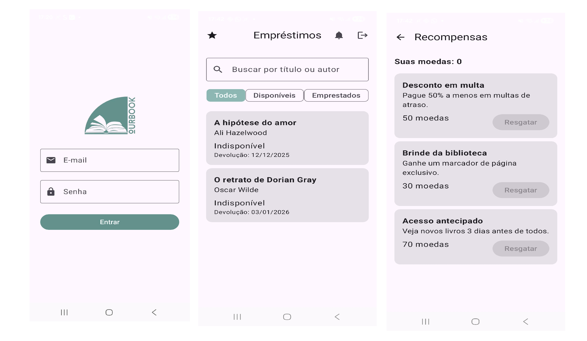

# OurBook



Aplicativo de biblioteca gameficado para aluguel de livros. O sistema permite consultar títulos disponíveis, realizar empréstimos e acompanhar prazos, oferecendo uma experiência simples e intuitiva ao usuário.


**Tecnologias Utilizadas**

<div> 
   
   
   
   
   
</div>


**Pré-requisitos**
- JDK 11
- Android Studio (recomendado)
- Android SDK com `compileSdk = 36`
- Uso do wrapper Gradle: execute `./gradlew` (não precisa instalar Gradle globalmente)

**Como compilar e executar**
- Compilar APK debug: `./gradlew assembleDebug`
- Limpar build: `./gradlew clean`
- Instalar no dispositivo/emulador (após assemble):

```bash
adb install -r app/build/outputs/apk/debug/app-debug.apk
```

- Executar testes unitários: `./gradlew test`
- Executar testes instrumentados (com dispositivo/emulador conectado): `./gradlew connectedAndroidTest`

**Estrutura do projeto**
```bash
OurBook/
├── app/
│   └── src/
│       └── main/
│           ├── java/com/example/ourbook/
│           │
│           │   ├── model/
│           │   │   ├── Book.kt
│           │   │   ├── NotificationItem.kt
│           │   │   ├── RewardItem.kt
│           │   │   └── User.kt
│           │   │
│           │   ├── navigation/
│           │   │   └── OurBookNav.kt
│           │   │
│           │   ├── ui/
│           │   │   ├── screen/
│           │   │   │   ├── login/
│           │   │   │   │   ├── LoginScreen.kt
│           │   │   │   │   └── LoginViewModel.kt
│           │   │   │   │
│           │   │   │   ├── home/
│           │   │   │   │   ├── HomeScreen.kt
│           │   │   │   │   └── HomeViewModel.kt
│           │   │   │   │
│           │   │   │   ├── bookdetail/
│           │   │   │   │   ├── BookDetailScreen.kt
│           │   │   │   │   └── BookDetailViewModel.kt
│           │   │   │   │
│           │   │   │   ├── rewards/
│           │   │   │   │   ├── RewardsScreen.kt
│           │   │   │   │   └── RewardsViewModel.kt
│           │   │   │   │
│           │   │   │   └── loan/
│           │   │   │       ├── LoanScreen.kt
│           │   │   │       └── LoanViewModel.kt
│           │   │   │
│           │   │   ├── components/
│           │   │   │   ├── BookCard.kt
│           │   │   │   ├── RewardCard.kt
│           │   │   │   └── AppTopBar.kt
│           │   │   │
│           │   │   └── theme/
│           │   │       ├── Color.kt
│           │   │       ├── Shapes.kt
│           │   │       ├── Theme.kt
│           │   │       └── Type.kt
│           │   │
│           │   ├── repository/
│           │   │   └── BookRepository.kt
│           │   │
│           │   ├── remote/
│           │   │   └── FirebaseDataSource.kt
│           │   │
│           │   └── MainActivity.kt
│           │
│           └── res/
│               ├── drawable/
│               ├── mipmap/
│               └── values/
│
├── build.gradle
├── settings.gradle
└── README.md
```

**Como desenvolver**
- Abra o projeto no Android Studio
- Execute o app em um emulador ou dispositivo físico
- Crie branches para features/bugs e envie pull requests com descrições claras

**Contribuição**
<table>
  <tr>
   <td align="center">
      <a href="https://github.com/jessyekessia" title="gitHub">
        <br>
        <sub>
          <b>Jessye Késsia Pereira</b>
        </sub>
      </a>
    </td>
    <td align="center">
      <a href="https://github.com/Maira-larissa" title="gitHub">
        <br>
        <sub>
          <b>Maira Larissa</b>
        </sub>
      </a>
    </td>
     <td align="center">
      <a href="https://github.com/iamjonn" title="gitHub">
        <br>
        <sub>
          <b>Jonata Nascimento</b>
        </sub>
      </a>
    </td>
      </a>
    </td>
  </tr>
</table>
